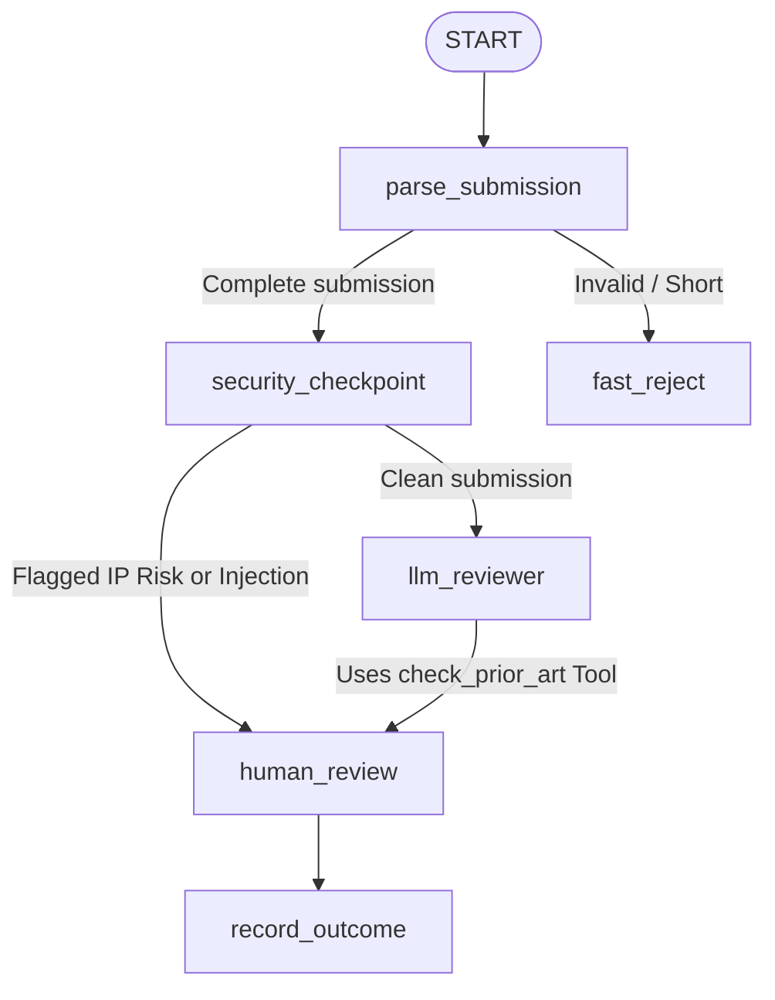

# IP-Guard: Automated B2B Enterprise Innovation & IP Screener
### *Course Capstone Project Submission*

IP-Guard is an automated, stateful screening agent built with the **Google Agent Development Kit (ADK)**. It serves as a first-pass compliance and novelty filter for corporate patent and innovation submissions before they reach corporate legal counsel.

---

## 🌟 Key Concepts & Features Demonstrated

This project showcases three major concepts learned during the course:

### 1. Stateful ADK Workflows
Built entirely on the **ADK 2.0 Graph Workflow engine**, demonstrating deterministic routing, state tracking, and nodes pipeline coordinates:
*   **Edge Routing**: The agent routes proposals dynamically based on quality validation and security outcomes.
*   **State Management**: It maintains unified state (`WorkflowState`) carrying redacted types, license warnings, and AI prior-art analysis.

### 2. Advanced Security Guardrails
Enterprise-ready compliance nodes defending the model and company against three distinct risks:
*   **PII & Developer Secret Scrubbing**: Regex filters redact credentials (e.g. `api_key="..."`, passwords) and sensitive user identifiers (SSNs, Credit Cards) in the parser node to prevent prompt leakage.
*   **Forbidden License Compliance**: Automatically scans technical descriptions and libraries for copyleft licenses (e.g. `GPL-3.0`, `AGPL`) violating whitelists.
*   **Prompt Injection / Jailbreak Bypass**: Keyword checks catch instructions bypass attempts, bypassing the LLM entirely and routing straight to human review with high-priority banners.

### 3. Agent Skills & Human-In-The-Loop (HITL)
*   **Custom Agent Tool (Skill)**: Exposes `check_prior_art(query)` to lookup existing patents in a simulated registry (e.g. distributed ledgers, AI firewalls).
*   **Interactive HITL Pause/Resume**: Uses `RequestInput` to pause execution, presenting counsel with a structured summary, scrubbed secrets, and prior-art details. Counsel can interactive select `APPROVE` or `REJECT` and add feedback.

---

## 🗺️ Agent Workflow Architecture



*   **`parse_submission`**: Validates input structure. Auto-rejects entries with empty titles or short descriptions (< 15 characters).
*   **`security_checkpoint`**: Performs regex redacting, injection scanning, and GPL detection.
*   **`llm_reviewer`**: Calls Gemini to evaluate novelty and commercial impact, utilizing the `check_prior_art` tool.
*   **`human_review`**: Suspends workflow and waits for legal approval.
*   **`record_outcome`**: Outputs the final status and audit trail.

---

## 🧪 Automated Test Coverage & Verification

We verified the agent workflow using a robust test suite covering edge cases, routing rules, security violations, and end-to-end FastAPI endpoint streaming:

```bash
uv run pytest tests/integration
```

**Results**:
```
collected 10 items

tests/integration/test_agent.py .....                                    [ 50%]
tests/integration/test_agent_runtime_app.py ..                           [ 70%]
tests/integration/test_server_e2e.py ...                                 [100%]

======================= 10 passed, 16 warnings in 14.50s =======================
```

---

## 🚀 Local Development & Interactive Testing

### Quick Start
1. Install dependencies:
   ```bash
   agents-cli install
   ```
2. Start the local agent playground:
   ```bash
   agents-cli playground --port 8090
   ```
3. Open your browser to access the interactive web interface:
   ```
   http://127.0.0.1:8090/dev-ui/?app=app
   ```
